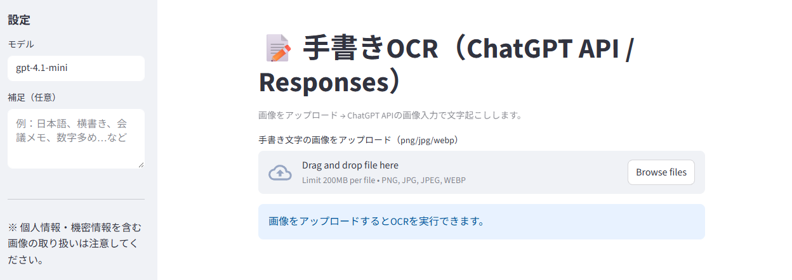
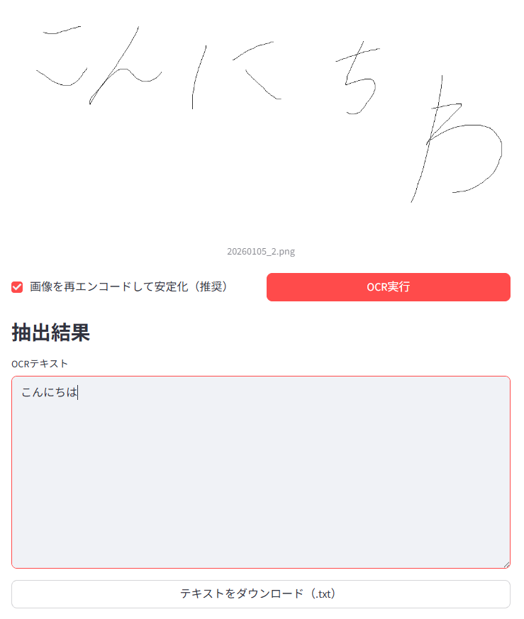

# 簡易OCRアプリ

## 概要
- 手書きメモなどの画像ファイルをアップロードし、書いてある文字を電子化するツールです
- スクリプトはすべてChatGPTで生成しました

## スクリプト生成環境
- 生成AI：ChatGPT 5.2
- 入力したプロンプト：streamlitで、手書き文字の画像をアップロードするとOCRで文字を抜き出すアプリを作りたいです。OCRの部分はChatGPT APIを使用する前提です。pythonは3.14.0を使用します。スクリプトを書いてください。
- 生成結果：app.py

## アプリ実行環境
- OS：Windows 11
- Python 3.14.0
- streamlit 1.52.2
- openai 2.14.0

## アプリ実行方法
- Windows 11 に3.14系のPythonをインストールします
- PowerSellを起動します
- pipコマンドでstreamlitとopenaiをインストールします
    - コマンド例：python -m pip install streamlit openai
- OpenAI APIキーを環境変数に一時追加します
    - $ENV:OPENAI_API_KEY = "enter-your-api-key"
- リポジトリのルートで下記コマンドを実行し、アプリを起動します
    - streamlit run app.py
    - メールアドレス等の入力を求められる場合がありますが、無視してEnterでOK
- localhostの8501ポートからアプリにアクセスします(基本的にブラウザ自動起動します)

- 手書き文字画像をドラッグ＆ドロップしてアップロードします
- OCR実行ボタンを押下すると、画像データから文字の抽出を行います

- 抽出した文字列はtxtファイルでダウンロードできます

## サンプルデータ
- 筆者がペイントで手書きした"こんにちは"という文字列です(imgs/20260105_2.png)
- 非常に下手くそです、"こんにちわ"と誤字もしています
- それでも"こんにちは"と認識してくれました
